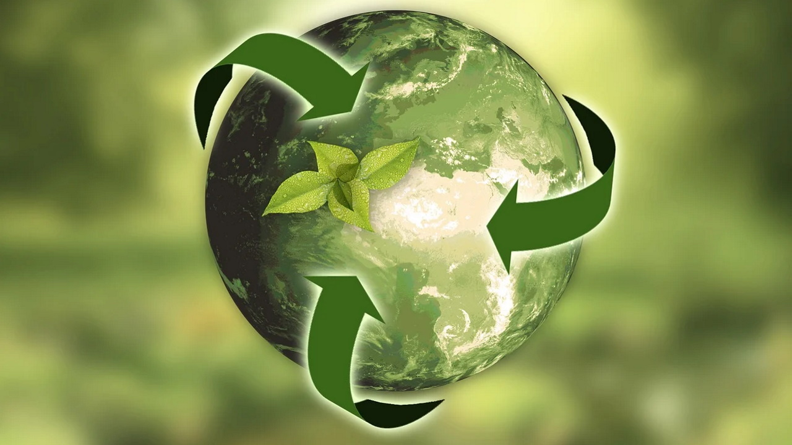

# Unidad 1 — Introducción

> "La sostenibilidad es un concepto que busca satisfacer las necesidades del presente sin comprometer la capacidad de las generaciones futuras para satisfacer las suyas."

**Notas:**  
La imagen debe estar guardada en `UD1/img/` (por ejemplo `sostenibilidad.jpg`). Puedes bajarte cualquier imagen relacionada con sostenibilidad.

---

Volver al [índice general](../README.md)
